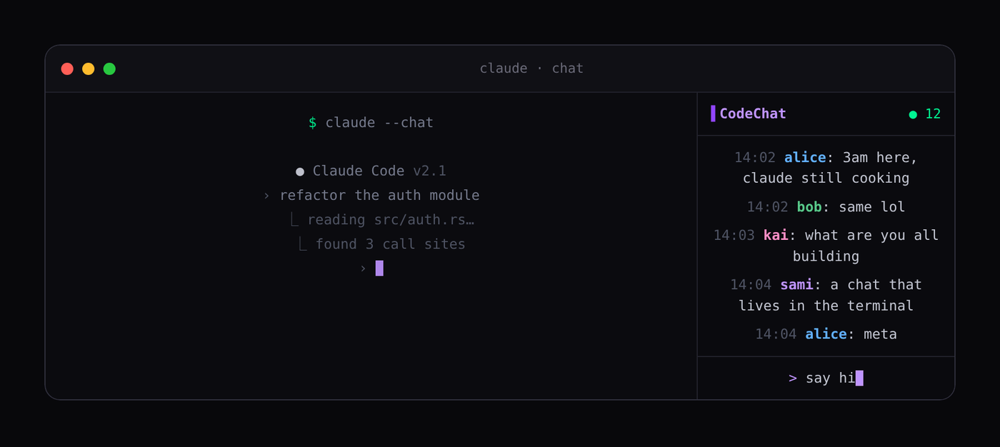

# CodeChat

Coding with an AI gets quiet. CodeChat is a little worldwide chat that lives in
your terminal, right next to Claude Code. Everyone who installs it lands in the
same room. Pick a name, say hi.

**[codechat.live](https://codechat.live)**



## Install

You need [Claude Code](https://claude.com/claude-code) and tmux, then one line:

```bash
sudo apt install tmux     # macOS: brew install tmux
curl -fsSL https://codechat.live/install.sh | bash
claude --chat
```

Open a new terminal and run `claude --chat`. Claude Code opens on the left, the chat
on the right. Plain `claude` still works exactly as before; the installer just
adds one alias and drops two small files in `~/.local/bin`.

Linux and macOS (Windows through WSL). No compilers or libraries needed; it downloads
one static binary. To uninstall, delete `~/.local/bin/codechat*`, `~/.codechat`,
and the alias line.

### Rather use VS Code?

```bash
curl -L https://github.com/SamiNasry/codechat/releases/latest/download/codechat.vsix -o codechat.vsix && code --install-extension codechat.vsix
```

Click the CodeChat bubble in the sidebar. Same room, same name (it reads the same
`~/.codechat/config.json`), and it works on Windows too, no tmux needed.

The VS Code sidebar includes an online-user mention menu, a small emoji picker,
a one-click invite link, and edit/delete controls on messages sent by this
installation. The terminal offers the same capabilities through compact chat
commands; type `/help` to see them. Both clients share the same message identity,
highlight mentions, and reflect edits or deletions in real time.

Terminal chat commands:

- `/users` lists visible users; `/mention <name> -- <message>` mentions one.
- `/edit <new text>` edits the latest message owned by this installation.
- `/delete` asks for confirmation before deleting that latest owned message.
- `/invite` shows the public invite link; `/quit` closes the chat.
- `:smile:`, `:joy:`, `:heart:`, `:fire:`, `:rocket:`, `:thumbsup:`,
  `:check:`, and `:eyes:` expand to emoji in either client. Native Unicode
  emoji can still be typed or pasted directly.

## Good to know

- It's **one public room**: anyone can read and write, so don't paste secrets or
  private code.
- Enter sends, 300 characters max. Close the chat with Ctrl-C; bring it back with
  `claude --chat-only`.
- New joiners see the last 50 messages. Everything renders as plain text, so
  nothing can run on your machine.
- The online count represents clients actively showing the chat. Hiding the VS
  Code sidebar removes that client from presence until it is shown again.
- There are still no accounts. A random owner token in
  `~/.codechat/config.json` authorizes edits and deletions from that installation;
  keep the file private. Removing it also removes access to those message controls.
- Want to watch it move on your own? Open another terminal: `codechat-tui --username somebody`.

## Under the hood

A bash wrapper makes the tmux split and passes every argument through to the real
`claude`. A tiny single-binary Rust client (`codechat-tui`) does the chat, and
everyone connects to one Supabase Realtime channel. The backend URL and
publishable key are baked in. A publishable key is an address, not a secret.

Build it yourself with Rust 1.88 or newer using
`cd tui && cargo build --release`. Want your own private room? Point the
`DEFAULT_SUPABASE_*` constants in `tui/src/main.rs` at a free
Supabase project, run `supabase/schema.sql` in the SQL editor, and tag a release.
Re-run the schema after upgrading an existing installation: it is idempotent and
adds the owner-authorized message functions without exposing owner tokens through
the public table API. Older clients remain able to read and post messages.

## Development checks

The VS Code client keeps its checks dependency-free:

```bash
cd vscode
npm test
npm run check
```

For the terminal client:

```bash
cd tui
cargo fmt --check
cargo test
```

## License

Do whatever you want with it.
